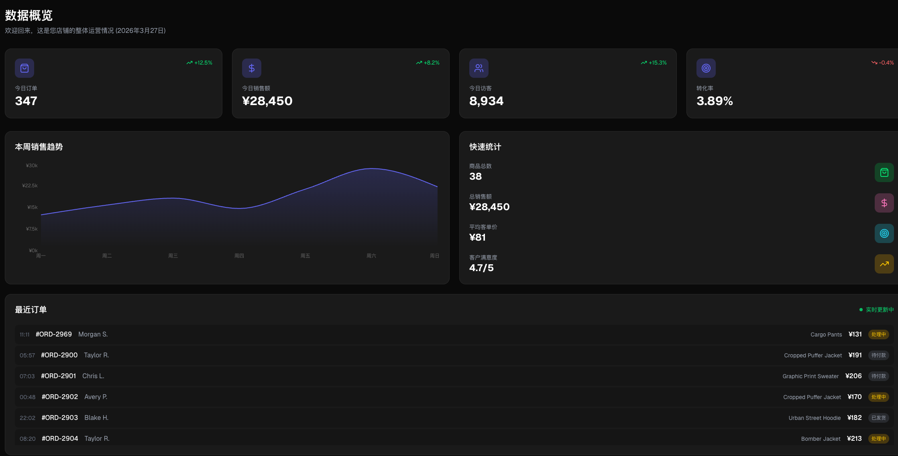
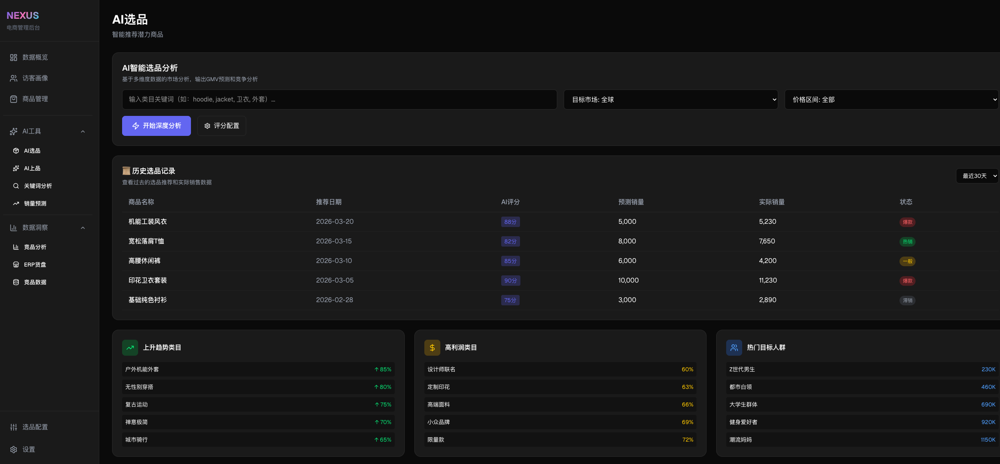
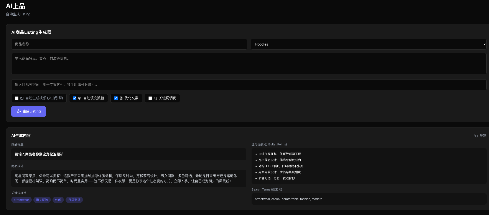
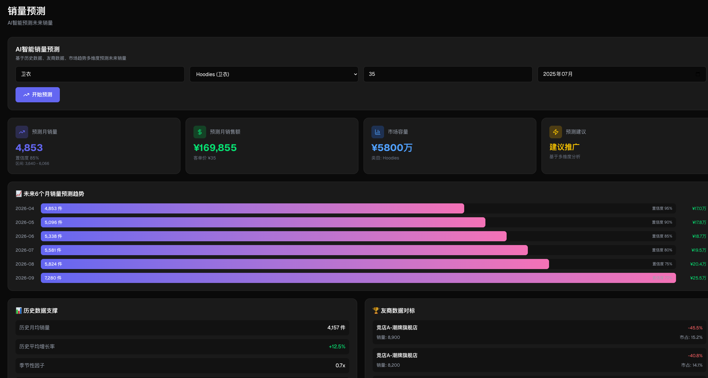
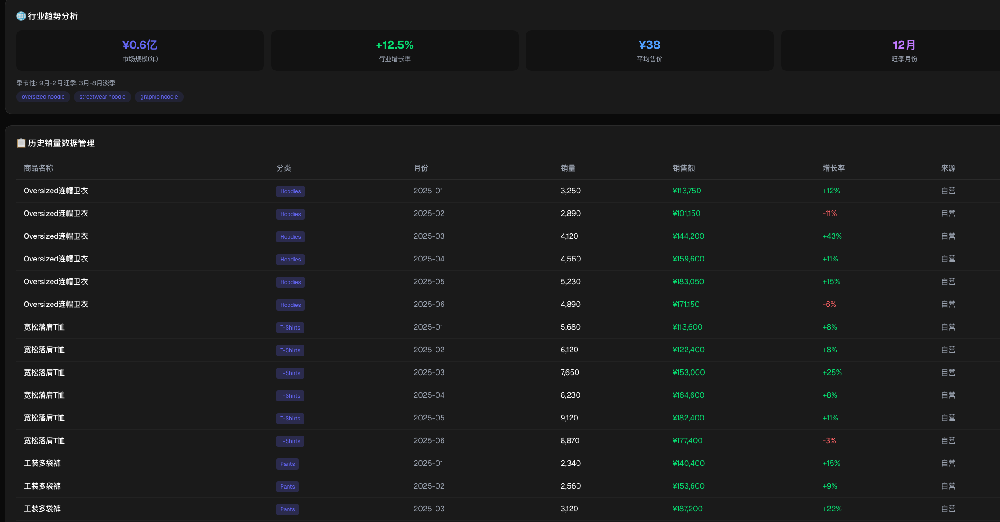
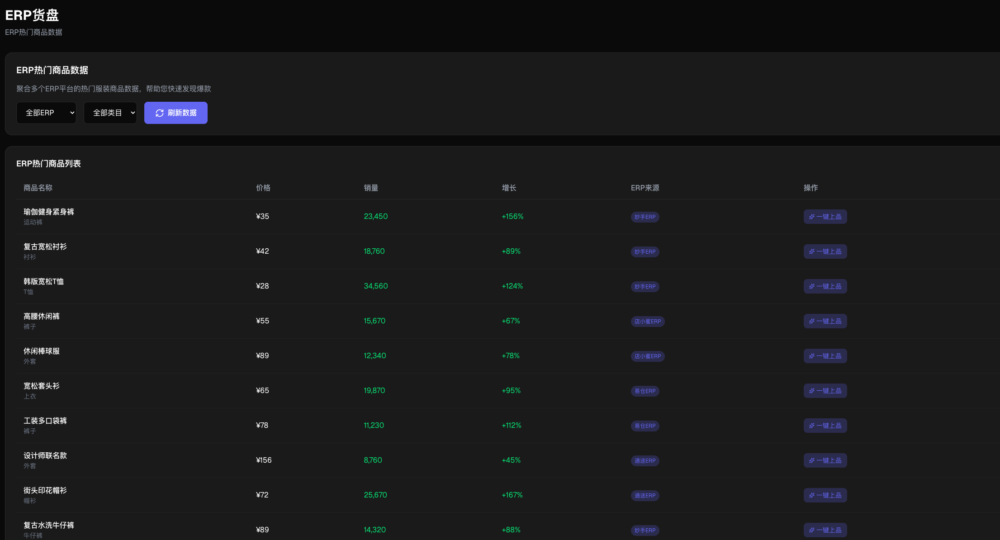
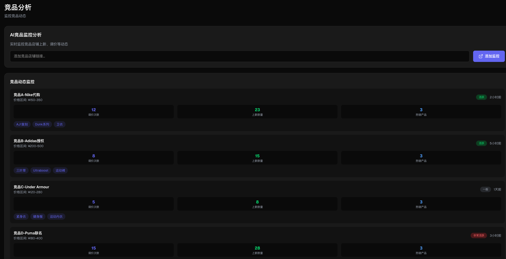

# KuaJingAIGC-OPC (跨境电商智能体)

> 跨境服装电商独立站 + AI 智能选品运营工具

## 项目介绍

**KuaJingAIGC-OPC** 是一个基于 Next.js 14 构建的跨境服装电商管理平台，集成 AI 智能工具助力跨境卖家的选品与运营。

## 特性

- 🚀 **AI 选品** - 输入类目关键词，智能分析市场需求、竞争强度、利润空间，输出潜力商品推荐及 GMV 预测
- 🎬 **AI 上品** - 自动生成商品标题、描述、卖点文案，调用火山引擎 Seedance 生成商品视频
- 📊 **关键词分析** - 聚合 Amazon、TikTok、Reddit 平台关键词热度与竞价
- 📈 **销量预测** - 多维度预测算法（历史/友商/市场/季节/价格/社交热度），输出未来6个月销量趋势
- 🏪 **数据洞察** - 竞品监控、ERP 货盘、竞品店铺数据分析

## 技术栈

- Next.js 14 (App Router)
- TypeScript
- Tailwind CSS
- Framer Motion
- Lucide Icons

## 快速开始

### 1. 克隆项目

```bash
git clone https://github.com/awanawana/KuaJingAIGC-OPC.git
cd KuaJingAIGC-OPC
```

### 2. 安装依赖

```bash
npm install
# 或
bun install
```

### 3. 配置环境变量

在项目根目录创建 `.env.local` 文件：

```env
# 火山引擎 Seedream/Seedance API Key (用于AI生成商品视频)
SEEDREAM_KEY=your_api_key_here
```

### 4. 启动开发服务器

```bash
npm run dev
```

- 前台: http://localhost:3000
- 后台: http://localhost:3000/admin

## 后台登录

首次使用后台需要登录：

- **访问地址**: http://localhost:3000/admin
- **默认账号**: `awanawan`
- **默认密码**: `awanawan`

登录后可进入「账号管理」页面：
- 修改当前账号密码
- 添加新的管理员账号
- 删除其他管理员账号

## 项目预览

### 前台首页


### 后台 - 数据概览


### 后台 - AI 选品


### 后台 - AI 上品 (含火山引擎视频生成)


### 后台 - 销量预测 (预测核心指标)


### 后台 - 销量预测 (未来趋势)


### 后台 - ERP 货盘数据


### 后台 - 竞品监控


### 选品到上品联动 (视频演示)
https://github.com/awanawana/KuaJingAIGC-OPC/blob/main/docs/images/all.mov

## 页面功能

### 前台 (/)

- Hero 区域轮播展示
- 热门商品网格
- 分类筛选
- 客服二维码（微信、小红书）

### 后台 (/admin)

| 页面 | 功能 |
|------|------|
| 数据概览 | 销售趋势、转化率、访客统计图表 |
| 访客画像 | 用户地域、年龄分布 |
| 商品管理 | 商品列表、上新品 |
| AI 选品 | 关键词分析、潜力商品推荐、竞品链接 |
| AI 上品 | 自动生成 Listing、视频生成 |
| 关键词分析 | Amazon/TikTok/Reddit 关键词热度 |
| 销量预测 | 多维度销量预测、未来趋势 |
| 竞品分析 | 竞品店铺监控 |
| ERP 货盘 | 热门商品数据聚合 |
| 竞品数据 | 竞店数据分析 |

## 环境变量

| 变量名 | 必填 | 说明 |
|--------|------|------|
| `SEEDREAM_KEY` | ✅ | 火山引擎 API Key，用于生成商品视频 |

获取 API Key:
1. 访问 [火山引擎](https://www.volcengine.com/)
2. 注册账号并创建应用
3. 获取 API Key

## 项目结构

```
├── public/              # 静态资源 (二维码图片)
├── src/
│   ├── app/
│   │   ├── admin/       # 后台页面
│   │   ├── api/         # API 路由 (图片生成)
│   │   ├── product/     # 商品详情页
│   │   ├── page.tsx    # 前台首页
│   │   └── layout.tsx  # 全局布局
│   └── lib/
│       └── data.ts     # Mock 数据
├── .env.local          # 环境变量 (需创建)
├── package.json
├── tailwind.config.ts
└── tsconfig.json
```

## 贡献

欢迎提交 Issue 和 Pull Request！

## 许可证

MIT License

---

Made with ❤️ for Cross-border E-commerce